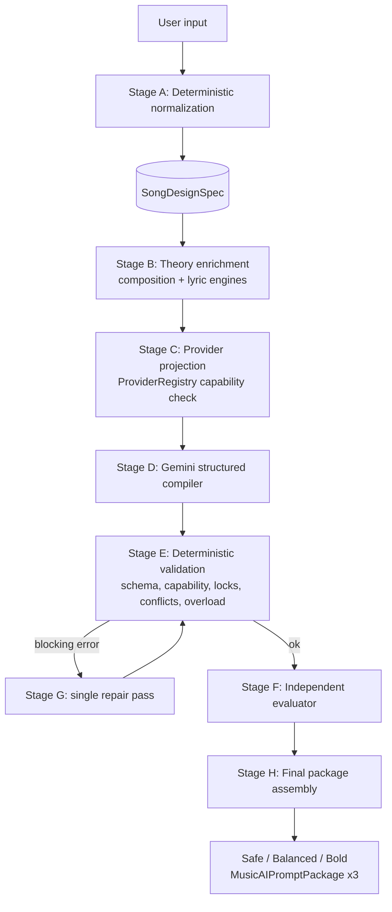
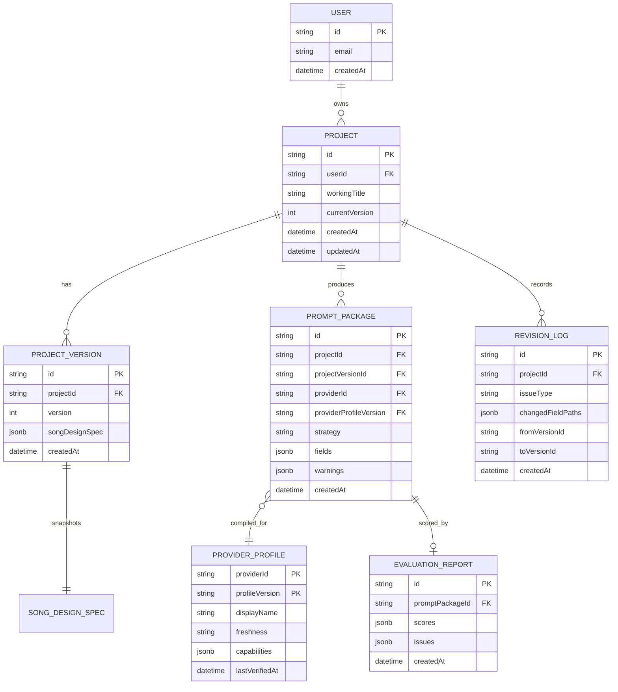

# Music Prompt Architect — Architecture

This document is generated from the Phase 0/1 planning pass. It records the system pipeline, the
module map for the single Next.js application, and a forward-compatible ERD draft for the Phase 2
persistence layer. See `DECISIONS.md` ADR-019 through ADR-023 for the decisions behind these
choices, and `IMPLEMENTATION_PLAN.md` §0.1 for the first-slice vs. MVP boundary.

## 1. Pipeline

`docs/PRODUCT_SPEC.md` §9 Stage A–H is the authoritative detailed form of the 10-step pipeline
summarized in `CLAUDE.md` §4 (mapping table in `DECISIONS.md` ADR-023).



In the first slice, Stage B (theory enrichment) is a pass-through stub — the real theory engines
(`FormFunctionEngine`, `ProsodyEngine`, etc.) are Phase 4. Stage D is served by either the
deterministic `MockPromptCompiler` (used in CI and this slice) or the `GeminiPromptCompiler`
(interface/skeleton only in this slice; live wiring is Phase 3).

## 2. Module map (single Next.js app, no monorepo yet — ADR-019)

```text
src/
  app/                       Next.js App Router pages/layout (minimal for this slice)
  domain/
    songDesignSpec/          types + Zod schema + normalizer + validator
    promptPackage/            MusicAIPromptPackage types + Zod schema
    providerCapability/        ProviderCapabilityProfile types + Zod schema
    evaluation/                PromptQualityReport types
    revision/                  RevisionDiagnosis types (stub — real logic is Phase 6)
    provenance.ts
  providers/
    registry.ts               ProviderRegistry interface + in-memory implementation
    profiles/generic.ts | suno.ts | udio.ts
  llm/
    types.ts                 LLMProvider interface
    mock/mockLLMProvider.ts, mockPromptCompiler.ts, mockPromptEvaluator.ts
    gemini/geminiLLMProvider.ts, geminiPromptCompiler.ts, geminiPromptEvaluator.ts (skeleton only)
  compiler/
    pipeline.ts               Stage A-H orchestration
  lib/
    env.ts                    server-only env accessor/validator (never imported by client code)
tests/unit/
```

## 3. ERD draft (Phase 2 persistence — drafted now for forward-compatibility)

No ORM/migration tool is chosen yet (pending decision in `DECISIONS.md`). This ERD is a draft for
alignment only; nothing here is scaffolded in the first slice.


